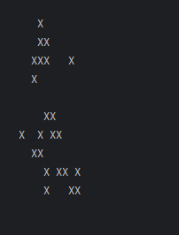
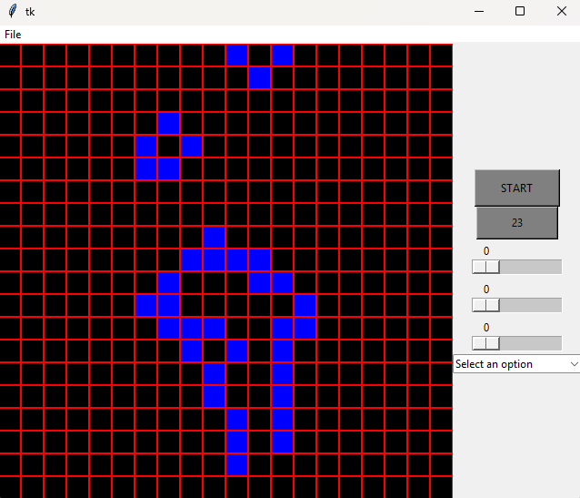

# Game of life in python

## How to download

- Simply download [the source code from github](https://github.com/klapekm/game_of_life.git)
- Unpack the files and open the version of the game of life you want to run

## Console version



- Find and run ```python game_of_life_console/game_of_life.py```
- If you want to have another starting state change the ```game_of_life_settings``` file 

## pyGame version



- Find and run either ```python game_of_life_tkinter/game_of_life_user_input.py``` or ```python game_of_life_tkinter/game_of_life_user_input_canvas.py```
